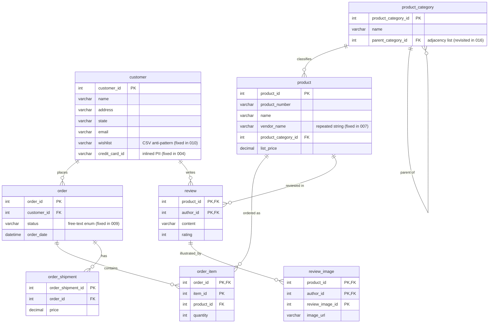

# Advanced Database Design Patterns in Action

**🇬🇧 English** ｜ [🇯🇵 日本語](README.ja.md)

> A hands-on catalogue of **25 advanced relational database design patterns**, implemented as a single SQL Server (`OnlineStore`) schema that **evolves over time** — from a naive, anti-pattern-ridden first draft into a normalized, partitioned, temporal, secured and performance-tuned production model.

This portfolio is built as a **sequence of 26 migration scripts**, each tackling one real modeling decision an application developer actually faces — _"how do I track price changes?"_, _"how do I store a wishlist?"_, _"this column is killing read performance, now what?"_ — and each ending with an honest note on the **trade-off** and **when not to use it**.

---

## The schema

`OnlineStore` is a small e-commerce database organised into three schemas — `person`, `sales`, and `production`. The 26 migrations take it from the naive **starting point** below to the fully **evolved model** further down.

### Before — the starting point

[`src/000_initial_schema_creation.sql`](src/000_initial_schema_creation.sql) is deliberately imperfect, so the later scripts have something real to fix.



### After — once all 26 migrations are applied

Lookup, junction and subtype tables; history and i18n tables; natural keys; and JSON-denormalised reviews — the cumulative result of running every migration in order. The annotations show which migration introduced each change. _(Standalone utility tables — `number`, `calendar`, `migration_history` — and the partitioning-demo `order_report` family are omitted for clarity.)_

```mermaid
erDiagram
    state ||--o{ customer : validates
    customer ||--o| customer_description : "1:1 split"
    customer ||--o{ credit_card : has
    customer ||--o{ order : places
    customer ||--o{ customer_wishlist : wants
    product_category ||--o{ product : classifies
    product_category ||--o{ product_category_translation : translated_by
    language ||--o{ product_category_translation : provides
    vendor ||--o{ product : supplies
    product ||--o| software_product : "subtype"
    product ||--o| hardware_product : "subtype"
    product ||--o{ promotion : discounted_by
    product ||--o{ product_review : reviewed_in
    product ||--o{ order_item : ordered_as
    product ||--o{ customer_wishlist : listed_in
    order_status_type ||--o{ order : labels
    order_status_type ||--o{ order_status_history : labels
    order ||--o{ order_item : contains
    order ||--o{ order_shipment : has
    order ||--o{ order_status_history : tracked_by
    order_shipment ||--o{ order_item_shipment : details
    order_item ||--o{ order_item_shipment : shipped_as

    customer {
        int customer_id PK
        nvarchar first_name "split from name (005), NVARCHAR (019)"
        nvarchar last_name
        varchar state FK "now validated (008)"
        datetime deleted_at "soft delete (020)"
    }
    state {
        varchar state_id PK "lookup (008)"
        varchar name
    }
    customer_description {
        int customer_id PK,FK "vertical split (015)"
        varchar description
    }
    credit_card {
        varchar credit_card_id PK "extracted (004)"
        int customer_id FK
        varbinary credit_card_id_encrypted "encrypted (023)"
    }
    product {
        varchar product_id PK "natural key (001)"
        varchar name
        int product_category_id FK
        int vendor_id FK "lookup (007)"
        decimal list_price
        decimal average_rating "computed+persisted (022)"
    }
    vendor {
        int vendor_id PK "lookup (007)"
        varchar name
    }
    product_category {
        int product_category_id PK
        varchar name
        varchar path "hierarchy (016)"
        hierarchyid hierarchy "hierarchy (016)"
    }
    software_product {
        varchar software_product_id PK,FK "subtype (017)"
        varchar compatible_os
        float required_ram
    }
    hardware_product {
        varchar hardware_product_id PK,FK "subtype (018)"
        float weight
        float height
    }
    promotion {
        varchar product_id PK,FK "effective dates (013)"
        date effective_start_date PK
        date effective_end_date
        int discount_percent
    }
    product_review {
        varchar product_id PK,FK "JSON denormalised (021)"
        int review_id PK
        varchar content "ISJSON CHECK"
    }
    language {
        char language_id PK "i18n (019)"
        nvarchar name
    }
    product_category_translation {
        int product_category_translation_id PK,FK "i18n (019)"
        char language_id PK,FK
        nvarchar product_category_name
        bit is_default
    }
    order {
        int order_id PK
        int customer_id FK
        tinyint order_status_type_id FK "lookup (009)"
        datetime order_date
    }
    order_status_type {
        tinyint order_status_type_id PK "enum lookup (009)"
        varchar name
    }
    order_item {
        int order_id PK,FK
        int item_id PK
        varchar product_id FK
        int quantity
        decimal list_price "pricing (013)"
        int discount_percent
    }
    order_shipment {
        int order_shipment_id PK
        int order_id FK
        decimal price
        bit is_complete "filtered index (011)"
    }
    order_item_shipment {
        int order_shipment_id PK,FK "master-detail (011)"
        int order_item_shipment_id PK
        int order_id FK
        int order_item_id FK
        varchar product_id FK
    }
    customer_wishlist {
        int customer_id PK,FK "M:N junction (010)"
        varchar product_id PK,FK
        varchar wishlist_name
    }
    order_status_history {
        int order_status_history_id PK "status history (012)"
        int order_id FK
        tinyint order_status_type_id FK
        datetime order_date
    }
```



---

## The 25 patterns

Row `000` is the initial schema setup; the 25 design patterns themselves are `001`–`025`. Each row links to the **runnable SQL** and a short **write-up**. The "What it solves" column is a one-line summary of the problem each pattern addresses.

| #   | Pattern                                  | What it solves                                                                                               | Script                                                     | Notes                                                               |
| --- | ---------------------------------------- | ------------------------------------------------------------------------------------------------------------ | ---------------------------------------------------------- | ------------------------------------------------------------------- |
| 000 | Initial schema & diagnostic tooling      | Sets up the OnlineStore database, schemas, core tables, and the diagnostic procs/views used throughout.      | [sql](src/000_initial_schema_creation.sql)                 | [doc](docs/patterns/000-initial-schema.md)                          |
| 001 | Natural vs. surrogate keys               | Trade-offs of a natural business key vs. an auto-increment surrogate as the primary key.                     | [sql](src/001_primary_key.sql)                             | [doc](docs/patterns/001-primary-key.md)                             |
| 002 | Indexing strategy                        | How clustered-key choice, column order, included columns and covering indexes affect different query shapes. | [sql](src/002_indexing_strategy.sql)                       | [doc](docs/patterns/002-indexing-strategy.md)                       |
| 003 | Indexing foreign keys                    | Why unindexed foreign-key columns slow cascade deletes and joins, and how to find and fix them.              | [sql](src/003_foreign_key.sql)                             | [doc](docs/patterns/003-foreign-key.md)                             |
| 004 | Extracting sensitive columns (1:N)       | Moving credit-card data out of the customer row into its own table (1-to-many).                              | [sql](src/004_splitting_customer_table.sql)                | [doc](docs/patterns/004-splitting-customer-table.md)                |
| 005 | Zero-downtime column split               | Splitting a column while old and new code run at once, using dual-write triggers.                            | [sql](src/005_splitting_name_column.sql)                   | [doc](docs/patterns/005-splitting-name-column.md)                   |
| 006 | Data cleansing & format enforcement      | Cleaning inconsistent existing data and enforcing a format with a constraint.                                | [sql](src/006_simple_format.sql)                           | [doc](docs/patterns/006-simple-format.md)                           |
| 007 | Lookup table (repeated strings)          | Replacing a repeated free-text column with a referenced lookup table.                                        | [sql](src/007_vendor_lookup_table.sql)                     | [doc](docs/patterns/007-vendor-lookup-table.md)                     |
| 008 | Reference table (validation)             | Enforcing that a column holds only valid values via a reference table and FK.                                | [sql](src/008_state_lookup_table.sql)                      | [doc](docs/patterns/008-state-lookup-table.md)                      |
| 009 | Enum → lookup table                      | Replacing a free-text status with a controlled lookup table.                                                 | [sql](src/009_order_status_type_lookup_table.sql)          | [doc](docs/patterns/009-order-status-type-lookup-table.md)          |
| 010 | Many-to-many (junction table)            | Modelling a many-to-many relationship with a junction table.                                                 | [sql](src/010_associative_table.sql)                       | [doc](docs/patterns/010-associative-table.md)                       |
| 011 | Master-detail & filtered indexes         | Modelling a header/line-item relationship and using filtered indexes for selective lookups.                  | [sql](src/011_master_detail.sql)                           | [doc](docs/patterns/011-master-detail.md)                           |
| 012 | Status history & event sourcing          | Recording state changes over time, and rebuilding current state from an event log.                           | [sql](src/012_history_table_effective_date.sql)            | [doc](docs/patterns/012-history-table-effective-date.md)            |
| 013 | Effective-dating & temporal tables       | Date-ranged validity vs. auto-maintained system-versioned (temporal) history.                                | [sql](src/013_history_table_effective_start_end_dates.sql) | [doc](docs/patterns/013-history-table-effective-start-end-dates.md) |
| 014 | Horizontal (range) partitioning          | Splitting a large table by range for instant archival and faster range scans.                                | [sql](src/014_horizontal_partitioning.sql)                 | [doc](docs/patterns/014-horizontal-partitioning.md)                 |
| 015 | Vertical partitioning                    | Moving rarely-read columns into a separate table to keep hot rows narrow.                                    | [sql](src/015_vertical_partitioning.sql)                   | [doc](docs/patterns/015-vertical-partitioning.md)                   |
| 016 | Hierarchical data                        | Modelling tree data with path enumeration vs. the `hierarchyid` type.                                        | [sql](src/016_modeling_hierarchical_data.sql)              | [doc](docs/patterns/016-modeling-hierarchical-data.md)              |
| 017 | Subtype table (software)                 | Moving type-specific attributes into a subtype table (supertype/subtype).                                    | [sql](src/017_software_product_table.sql)                  | [doc](docs/patterns/017-software-product-table.md)                  |
| 018 | Subtype table + reassembly view          | A second subtype table plus a view that reassembles the unified product shape.                               | [sql](src/018_hardware_product_table.sql)                  | [doc](docs/patterns/018-hardware-product-table.md)                  |
| 019 | Multi-language data & collations         | Storing, sorting and comparing multilingual text correctly, and avoiding collation pitfalls.                 | [sql](src/019_handling_multilanguage_data.sql)             | [doc](docs/patterns/019-handling-multilanguage-data.md)             |
| 020 | Soft delete                              | Marking rows as deleted instead of removing them, and the query changes it requires.                         | [sql](src/020_soft_delete.sql)                             | [doc](docs/patterns/020-soft-delete.md)                             |
| 021 | Denormalization with JSON                | Storing a read-heavy aggregate as a JSON document to avoid repeated joins.                                   | [sql](src/021_denormalization_with_json.sql)               | [doc](docs/patterns/021-denormalization-with-json.md)               |
| 022 | Computed columns & maintained aggregates | Keeping a derived value (average rating) precomputed, persisted and indexed.                                 | [sql](src/022_computed_column.sql)                         | [doc](docs/patterns/022-computed-column.md)                         |
| 023 | Sensitive-data protection                | Exposing PII at different fidelity per role via masking, views and column encryption.                        | [sql](src/023_sensitive_data_obfuscation.sql)              | [doc](docs/patterns/023-sensitive-data-obfuscation.md)              |
| 024 | Numbers/calendar tables & indexed views  | Precomputed numbers/calendar tables and materialised (indexed) aggregate views.                              | [sql](src/024_precalculated_tables_and_indexed_views.sql)  | [doc](docs/patterns/024-precalculated-tables-and-indexed-views.md)  |
| 025 | Query-optimizer statistics               | How statistics drive the optimizer's plan choice, and what stale/skewed stats cause.                         | [sql](src/025_statistics.sql)                              | [doc](docs/patterns/025-statistics.md)                              |

---

## Run it yourself

Everything runs on **SQL Server 2022**, and the bundled Docker setup is fully self-contained — you don't need SQL Server or `sqlcmd` installed on your machine. The repo is mounted into the container at `/workspace`, and the commands below use the `sqlcmd` that ships inside the image.

> ⚠️ The scripts are **sequential migrations** — each one transforms the schema and data left by the previous one. Run them in order (`000` → seed → `001` → … → `025`); you can't apply one in isolation (e.g. `013` references columns that `007` and `009` add).

### 1. Start SQL Server

```bash
docker compose up -d
```

This launches `mcr.microsoft.com/mssql/server:2022-latest` on `localhost:1433` (user `sa`, password in [`docker-compose.yml`](docker-compose.yml)) with the repo mounted at `/workspace`.

### 2. Apply every script, in order

Wait for the server to accept connections, then run the whole sequence:

```bash
# wait until SQL Server is ready
until docker exec onlinestore-sqlserver bash -c \
  '/opt/mssql-tools18/bin/sqlcmd -S localhost -U sa -P Your_password123 -C -I -Q "SELECT 1"' \
  >/dev/null 2>&1; do
  echo 'waiting for SQL Server...'; sleep 2
done

# 000 (schema) -> seed data -> 001..025, in order, stopping on the first error
docker exec onlinestore-sqlserver bash -c '
  SQLCMD="/opt/mssql-tools18/bin/sqlcmd -S localhost -U sa -P Your_password123 -C -I -b"
  $SQLCMD -i /workspace/src/000_initial_schema_creation.sql
  $SQLCMD -i /workspace/helpers/seed_db.sql
  for f in /workspace/src/0*.sql; do
    case "$f" in */000_*) continue ;; esac
    echo ">>> applying $f"
    $SQLCMD -i "$f" || { echo "FAILED at $f"; exit 1; }
  done'
```

> The flags matter: `-C` trusts the container's self-signed certificate, `-I` enables `QUOTED_IDENTIFIER` (required by the filtered index, indexed view and computed-column index in scripts 011/022/024), and `-b` aborts the run on the first script that errors. Each script records itself in the `dbo.migration_history` table on completion, so you can always see how far the database has evolved.
>
> Every `sqlcmd` call is wrapped in `docker exec … bash -c '…'` so the `/opt/...` and `/workspace/...` paths are interpreted inside the container — this keeps the commands working unchanged on Windows (Git Bash), macOS and Linux.

For interactive exploration, connect to `localhost:1433` from [Azure Data Studio](https://learn.microsoft.com/azure-data-studio/) or SSMS (enable **Trust server certificate**) and open the scripts from [`src/`](src/).

### Reset to a clean slate

```bash
docker exec onlinestore-sqlserver bash -c \
  '/opt/mssql-tools18/bin/sqlcmd -S localhost -U sa -P Your_password123 -C -I -i /workspace/helpers/drop_db_objects.sql'
```

Then re-run the sequence above to rebuild from `000`. (To wipe everything including the data volume instead, use `docker compose down -v`.)

---

## Repository layout

```
.
├── src/                 # The 26 migration scripts (000 → 025), run in order
├── helpers/
│   ├── seed_db.sql      # Sample data
│   ├── drop_db_objects.sql  # Tear down to a clean state
│   └── conventions.sql  # Naming conventions used throughout (see below)
├── docs/
│   ├── patterns/        # One short write-up per pattern (problem / solution / trade-off)
│   ├── images/          # Diagrams & screenshots
│   └── slides.pdf       # Full course slide deck
├── docker-compose.yml   # One-command SQL Server 2022
└── README.md
```

## Naming conventions

The whole codebase follows one consistent convention (snake*case, `pk*`/`fk*`/`ix*`/`chk*`/`df*` prefixes, etc.), documented in [`helpers/conventions.sql`](helpers/conventions.sql). Consistency like this is deliberate — it's the kind of thing that makes a schema maintainable by a team.

---

## License

Code and documentation © Michał Panasiuk, released under the [MIT License](LICENSE).
