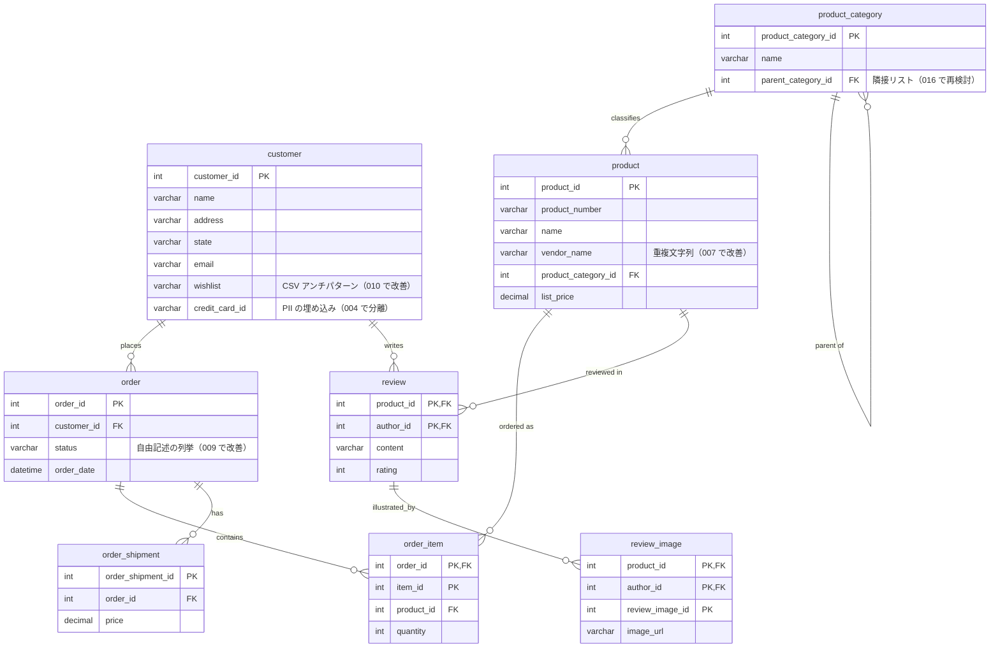

# 実践 リレーショナルデータベース設計パターン 25 選

<sub>Advanced Database Design Patterns in Action</sub>

[🇬🇧 English](README.en.md) ｜ **🇯🇵 日本語**

> SQL Server を題材に、リレーショナルデータベースの設計パターンを **25 個**、ひとつの `OnlineStore` スキーマを **段階的に育てながら** 実装した教材です。素朴で問題を含んだ初期設計から出発し、正規化・パーティショニング・履歴管理・セキュリティ・性能チューニングを施した、実用的なモデルへと進化させていきます。

このリポジトリは **26 本のマイグレーションスクリプトの連なり** として構成しています。それぞれが、アプリケーション開発の現場で実際に直面する設計判断を 1 つずつ題材にしています —— 例えば _「価格の変更履歴をどう追跡するか」_、_「ウィッシュリストをどう保存するか」_、_「このカラムが読み取り性能を落としている。どうするか」_ といった問いです。そして各スクリプトの最後には、**トレードオフ** と **採用すべきでない場面** についての率直なメモを添えています。

---

## 日本語・多言語データの取り扱いについて

本教材では、英語・ポーランド語・日本語を含む **多言語データ** を題材に、**照合順序（collation）** や文字化け対策、`VARCHAR` から `NVARCHAR` への安全な移行、言語ごとの並び替えなどを扱っています（[スクリプト 019](src/019_handling_multilanguage_data.sql)）。日本語のテキストを扱う際に問題になりがちな、ソート順・文字化け・Unicode の扱いといった点にも触れています。

---

## スキーマ

`OnlineStore` は `person`・`sales`・`production` の 3 つのスキーマからなる、小さな EC（電子商取引）データベースです。26 本のマイグレーションによって、下の **素朴な出発点** から、その先の **進化したモデル** へと作り替えていきます。

### 移行前 —— 出発点

下図は [`src/000_initial_schema_creation.sql`](src/000_initial_schema_creation.sql) の設計です。後続のスクリプトで改善していくことを前提に、あえて問題を含んだ状態にしてあります。



### 移行後 —— 26 本すべてを適用した状態

ルックアップテーブル・中間テーブル・サブタイプテーブル・履歴テーブル・多言語対応テーブルの追加、自然キーへの変更、JSON によるレビューの非正規化など、すべてのマイグレーションを順に適用した結果です。各注記は、その変更がどのスクリプトで導入されたかを示しています。_（`number`・`calendar`・`migration_history` などの独立したユーティリティテーブルと、パーティショニングのデモ用 `order_report` 系テーブルは、見やすさのため省略しています。）_

```mermaid
erDiagram
    state ||--o{ customer : validates
    customer ||--o| customer_description : "1:1 split"
    customer ||--o{ credit_card : has
    customer ||--o{ order : places
    customer ||--o{ customer_wishlist : wants
    product_category ||--o{ product : classifies
    product_category ||--o{ product_category_translation : translated_by
    language ||--o{ product_category_translation : provides
    vendor ||--o{ product : supplies
    product ||--o| software_product : "subtype"
    product ||--o| hardware_product : "subtype"
    product ||--o{ promotion : discounted_by
    product ||--o{ product_review : reviewed_in
    product ||--o{ order_item : ordered_as
    product ||--o{ customer_wishlist : listed_in
    order_status_type ||--o{ order : labels
    order_status_type ||--o{ order_status_history : labels
    order ||--o{ order_item : contains
    order ||--o{ order_shipment : has
    order ||--o{ order_status_history : tracked_by
    order_shipment ||--o{ order_item_shipment : details
    order_item ||--o{ order_item_shipment : shipped_as

    customer {
        int customer_id PK
        nvarchar first_name "name を分割（005）・NVARCHAR 化（019）"
        nvarchar last_name
        varchar state FK "検証付きに（008）"
        datetime deleted_at "論理削除（020）"
    }
    state {
        varchar state_id PK "ルックアップ（008）"
        varchar name
    }
    customer_description {
        int customer_id PK,FK "垂直分割（015）"
        varchar description
    }
    credit_card {
        varchar credit_card_id PK "分離（004）"
        int customer_id FK
        varbinary credit_card_id_encrypted "暗号化（023）"
    }
    product {
        varchar product_id PK "自然キー（001）"
        varchar name
        int product_category_id FK
        int vendor_id FK "ルックアップ（007）"
        decimal list_price
        decimal average_rating "計算列・PERSISTED（022）"
    }
    vendor {
        int vendor_id PK "ルックアップ（007）"
        varchar name
    }
    product_category {
        int product_category_id PK
        varchar name
        varchar path "階層（016）"
        hierarchyid hierarchy "階層（016）"
    }
    software_product {
        varchar software_product_id PK,FK "サブタイプ（017）"
        varchar compatible_os
        float required_ram
    }
    hardware_product {
        varchar hardware_product_id PK,FK "サブタイプ（018）"
        float weight
        float height
    }
    promotion {
        varchar product_id PK,FK "有効期間（013）"
        date effective_start_date PK
        date effective_end_date
        int discount_percent
    }
    product_review {
        varchar product_id PK,FK "JSON で非正規化（021）"
        int review_id PK
        varchar content "ISJSON 制約"
    }
    language {
        char language_id PK "多言語（019）"
        nvarchar name
    }
    product_category_translation {
        int product_category_translation_id PK,FK "多言語（019）"
        char language_id PK,FK
        nvarchar product_category_name
        bit is_default
    }
    order {
        int order_id PK
        int customer_id FK
        tinyint order_status_type_id FK "ルックアップ（009）"
        datetime order_date
    }
    order_status_type {
        tinyint order_status_type_id PK "列挙のルックアップ（009）"
        varchar name
    }
    order_item {
        int order_id PK,FK
        int item_id PK
        varchar product_id FK
        int quantity
        decimal list_price "価格（013）"
        int discount_percent
    }
    order_shipment {
        int order_shipment_id PK
        int order_id FK
        decimal price
        bit is_complete "フィルター選択インデックス（011）"
    }
    order_item_shipment {
        int order_shipment_id PK,FK "マスター・ディテール（011）"
        int order_item_shipment_id PK
        int order_id FK
        int order_item_id FK
        varchar product_id FK
    }
    customer_wishlist {
        int customer_id PK,FK "多対多の中間テーブル（010）"
        varchar product_id PK,FK
        varchar wishlist_name
    }
    order_status_history {
        int order_status_history_id PK "ステータス履歴（012）"
        int order_id FK
        tinyint order_status_type_id FK
        datetime order_date
    }
```



---

## 25 のパターン

下表の `000` は出発点となる初期スキーマの準備で、それに続く `001`〜`025` が 25 個の設計パターンです。各行から、**実行可能な SQL** と短い **解説（英語）** にリンクしています。「解決する課題」列は、各パターンが解決する問題を 1 行でまとめたものです。

| #   | パターン                                         | 解決する課題                                                                                         | スクリプト                                                 | 解説                                                                |
| --- | ------------------------------------------------ | ---------------------------------------------------------------------------------------------------- | ---------------------------------------------------------- | ------------------------------------------------------------------- |
| 000 | 初期スキーマと診断用ツール                       | OnlineStore データベース・スキーマ・主要テーブルと、全体で使う診断用プロシージャ／ビューを用意する。 | [sql](src/000_initial_schema_creation.sql)                 | [doc](docs/patterns/000-initial-schema.md)                          |
| 001 | 自然キー vs 代理キー                             | 主キーに業務上の自然キーを使うか、自動採番の代理キーを使うかのトレードオフ。                         | [sql](src/001_primary_key.sql)                             | [doc](docs/patterns/001-primary-key.md)                             |
| 002 | インデックス戦略                                 | クラスター化キーの選択・列順・付加列・カバリングが、クエリの形ごとにどう効くか。                     | [sql](src/002_indexing_strategy.sql)                       | [doc](docs/patterns/002-indexing-strategy.md)                       |
| 003 | 外部キーのインデックス                           | インデックスのない外部キー列がカスケード削除や結合を遅くする理由と、その発見・対処。                 | [sql](src/003_foreign_key.sql)                             | [doc](docs/patterns/003-foreign-key.md)                             |
| 004 | 機密カラムの分離（1 対多）                       | クレジットカード情報を顧客行から別テーブルへ分離する（1 対多）。                                     | [sql](src/004_splitting_customer_table.sql)                | [doc](docs/patterns/004-splitting-customer-table.md)                |
| 005 | 無停止でのカラム分割                             | 新旧のコードを並行稼働させたまま、デュアルライトのトリガーで列を分割する。                           | [sql](src/005_splitting_name_column.sql)                   | [doc](docs/patterns/005-splitting-name-column.md)                   |
| 006 | データクレンジングと形式の強制                   | 既存の不揃いなデータを整え、制約で形式を強制する。                                                   | [sql](src/006_simple_format.sql)                           | [doc](docs/patterns/006-simple-format.md)                           |
| 007 | ルックアップテーブル（重複文字列の排除）         | 繰り返される自由記述の列を、参照するルックアップテーブルに置き換える。                               | [sql](src/007_vendor_lookup_table.sql)                     | [doc](docs/patterns/007-vendor-lookup-table.md)                     |
| 008 | 参照テーブル（バリデーション）                   | 参照テーブルと外部キーで、列が有効な値だけを取るよう保証する。                                       | [sql](src/008_state_lookup_table.sql)                      | [doc](docs/patterns/008-state-lookup-table.md)                      |
| 009 | 列挙型 → ルックアップテーブル                    | 自由記述のステータスを、管理されたルックアップテーブルに置き換える。                                 | [sql](src/009_order_status_type_lookup_table.sql)          | [doc](docs/patterns/009-order-status-type-lookup-table.md)          |
| 010 | 多対多（中間テーブル）                           | 中間テーブルで多対多の関係をモデル化する。                                                           | [sql](src/010_associative_table.sql)                       | [doc](docs/patterns/010-associative-table.md)                       |
| 011 | マスター・ディテールとフィルター選択インデックス | ヘッダー・明細の関係をモデル化し、選択的な検索にフィルター選択インデックスを使う。                   | [sql](src/011_master_detail.sql)                           | [doc](docs/patterns/011-master-detail.md)                           |
| 012 | ステータス履歴とイベントソーシング               | 状態の変化を時系列で記録し、イベントログから現在の状態を再構築する。                                 | [sql](src/012_history_table_effective_date.sql)            | [doc](docs/patterns/012-history-table-effective-date.md)            |
| 013 | 有効期間とシステムバージョン管理テーブル         | 日付範囲での有効期間と、自動管理されるシステムバージョン管理（テンポラル）履歴。                     | [sql](src/013_history_table_effective_start_end_dates.sql) | [doc](docs/patterns/013-history-table-effective-start-end-dates.md) |
| 014 | 水平（範囲）パーティショニング                   | 大きなテーブルを範囲で分割し、即時アーカイブと高速な範囲検索を実現する。                             | [sql](src/014_horizontal_partitioning.sql)                 | [doc](docs/patterns/014-horizontal-partitioning.md)                 |
| 015 | 垂直パーティショニング                           | 参照頻度の低い列を別テーブルへ移し、よく使う行を狭く保つ。                                           | [sql](src/015_vertical_partitioning.sql)                   | [doc](docs/patterns/015-vertical-partitioning.md)                   |
| 016 | 階層データのモデリング                           | ツリー構造を、パス列挙と `hierarchyid` 型でモデル化する。                                            | [sql](src/016_modeling_hierarchical_data.sql)              | [doc](docs/patterns/016-modeling-hierarchical-data.md)              |
| 017 | サブタイプテーブル（ソフトウェア）               | 種類ごとに固有の属性をサブタイプテーブルへ移す（スーパータイプ／サブタイプ）。                       | [sql](src/017_software_product_table.sql)                  | [doc](docs/patterns/017-software-product-table.md)                  |
| 018 | サブタイプテーブルと再構成ビュー                 | もう 1 つのサブタイプテーブルと、統一された商品の形を再構成するビュー。                              | [sql](src/018_hardware_product_table.sql)                  | [doc](docs/patterns/018-hardware-product-table.md)                  |
| 019 | 多言語データと照合順序                           | 多言語テキストを正しく保存・ソート・比較し、照合順序の落とし穴を避ける。                             | [sql](src/019_handling_multilanguage_data.sql)             | [doc](docs/patterns/019-handling-multilanguage-data.md)             |
| 020 | 論理削除（ソフトデリート）                       | 行を削除せず「削除済み」と印を付ける方法と、それに伴うクエリの変更。                                 | [sql](src/020_soft_delete.sql)                             | [doc](docs/patterns/020-soft-delete.md)                             |
| 021 | JSON による非正規化                              | 参照の多い集約データを JSON ドキュメントとして保存し、繰り返しの結合を避ける。                       | [sql](src/021_denormalization_with_json.sql)               | [doc](docs/patterns/021-denormalization-with-json.md)               |
| 022 | 計算列と集計値の維持                             | 導出値（平均評価）を事前計算し、永続化・インデックス化して保つ。                                     | [sql](src/022_computed_column.sql)                         | [doc](docs/patterns/022-computed-column.md)                         |
| 023 | 機密データの保護（マスキング・暗号化）           | マスキング・ビュー・列暗号化により、ロールごとに PII の見え方を変える。                              | [sql](src/023_sensitive_data_obfuscation.sql)              | [doc](docs/patterns/023-sensitive-data-obfuscation.md)              |
| 024 | 連番・カレンダーテーブルとインデックス付きビュー | 事前計算した連番／カレンダーテーブルと、マテリアライズド（インデックス付き）集計ビュー。             | [sql](src/024_precalculated_tables_and_indexed_views.sql)  | [doc](docs/patterns/024-precalculated-tables-and-indexed-views.md)  |
| 025 | クエリオプティマイザーの統計情報                 | 統計情報がオプティマイザーのプラン選択をどう左右し、古い／偏った統計が何を招くか。                   | [sql](src/025_statistics.sql)                              | [doc](docs/patterns/025-statistics.md)                              |

---

## 動かしてみる

すべて **SQL Server 2022** 上で動作します。付属の Docker 構成は自己完結しており、お使いのマシンに SQL Server や `sqlcmd` をインストールする必要はありません。リポジトリはコンテナ内の `/workspace` にマウントされ、以下のコマンドはイメージに同梱の `sqlcmd` を使います。

> ⚠️ これらのスクリプトは **連続したマイグレーション** です。各スクリプトは、直前のスクリプトが残したスキーマとデータを変換します。必ず順番（`000` → シード → `001` → … → `025`）に実行してください。単独では適用できません（例えば `013` は、`007` と `009` が追加する列を参照します）。

### 1. SQL Server を起動する

```bash
docker compose up -d
```

`mcr.microsoft.com/mssql/server:2022-latest` を `localhost:1433` で起動し、リポジトリを `/workspace` にマウントします（ユーザーは `sa`、パスワードは [`docker-compose.yml`](docker-compose.yml) に記載）。

### 2. すべてのスクリプトを順番に適用する

サーバーが接続を受け付けるのを待ってから、一連のスクリプトをまとめて実行します。

```bash
# SQL Server が起動するまで待機
until docker exec onlinestore-sqlserver bash -c \
  '/opt/mssql-tools18/bin/sqlcmd -S localhost -U sa -P Your_password123 -C -I -Q "SELECT 1"' \
  >/dev/null 2>&1; do
  echo 'waiting for SQL Server...'; sleep 2
done

# 000（スキーマ）→ シードデータ → 001..025 を順に適用し、最初のエラーで停止
docker exec onlinestore-sqlserver bash -c '
  SQLCMD="/opt/mssql-tools18/bin/sqlcmd -S localhost -U sa -P Your_password123 -C -I -b"
  $SQLCMD -i /workspace/src/000_initial_schema_creation.sql
  $SQLCMD -i /workspace/helpers/seed_db.sql
  for f in /workspace/src/0*.sql; do
    case "$f" in */000_*) continue ;; esac
    echo ">>> applying $f"
    $SQLCMD -i "$f" || { echo "FAILED at $f"; exit 1; }
  done'
```

> フラグの意味: `-C` はコンテナの自己署名証明書を信頼し、`-I` は `QUOTED_IDENTIFIER` を有効化します（スクリプト 011/022/024 のフィルター選択インデックス・インデックス付きビュー・計算列インデックスに必要）。`-b` はエラーが出た最初のスクリプトで実行を中断します。各スクリプトは完了時に自身を `dbo.migration_history` テーブルに記録するため、データベースがどこまで進化したかをいつでも確認できます。
>
> すべての `sqlcmd` 呼び出しを `docker exec … bash -c '…'` で包んでいるのは、`/opt/...` や `/workspace/...` のパスをコンテナ内で解釈させるためです。これにより Windows（Git Bash）・macOS・Linux のいずれでもコマンドがそのまま動作します。

対話的に試す場合は、[Azure Data Studio](https://learn.microsoft.com/azure-data-studio/) や SSMS から `localhost:1433` に接続し（**サーバー証明書を信頼する** を有効化）、[`src/`](src/) のスクリプトを開いてください。

### クリーンな状態に戻す

```bash
docker exec onlinestore-sqlserver bash -c \
  '/opt/mssql-tools18/bin/sqlcmd -S localhost -U sa -P Your_password123 -C -I -i /workspace/helpers/drop_db_objects.sql'
```

その後、上記の手順をもう一度実行すれば `000` から作り直せます。（データボリュームごと完全に消すには `docker compose down -v` を使います。）

---

## リポジトリ構成

```
.
├── src/                 # 26 本のマイグレーションスクリプト（000 → 025）。順番に実行
├── helpers/
│   ├── seed_db.sql      # サンプルデータ
│   ├── drop_db_objects.sql  # クリーンな状態に戻す
│   └── conventions.sql  # 全体で用いる命名規則（下記参照）
├── docs/
│   ├── patterns/        # パターンごとの解説（課題 / 解決策 / トレードオフ）
│   ├── images/          # 図・スクリーンショット
│   └── slides.pdf       # 講座のスライド全編
├── docker-compose.yml   # SQL Server 2022 をワンコマンドで起動
└── README.md
```

## 命名規則

コードベース全体で、一貫した命名規則（snake*case、`pk*`／`fk*`／`ix*`／`chk*`／`df*` などの接頭辞）を用いています。詳細は [`helpers/conventions.sql`](helpers/conventions.sql) にまとめています。一貫性は、チームでスキーマを保守しやすくするための意図的な選択です。

---

## ライセンス

コードおよびドキュメントは © Michał Panasiuk、[MIT ライセンス](LICENSE) のもとで公開しています。
